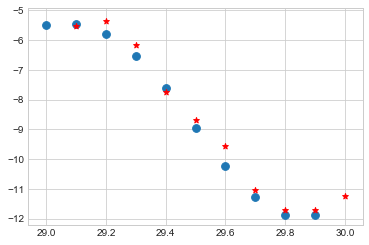

```python
###### using an rnn to generate signals to mimic a simple pattern #############33
###### tthis could be applied to the foreign exchange market, stocks market and basically anything with a trend i.e time series###
```


```python
import tensorflow as tf
import numpy as np
import matplotlib.pyplot as plt
plt.style.use("seaborn-whitegrid")
%matplotlib inline
import seaborn as sns
from sklearn.model_selection import train_test_split
```


```python
n_steps=10
n_inputs=1
n_neurons=100
n_outputs=1

def percent(rec,exp):
    import sys
    sys.stdout.write(str(round((rec/exp)*100,2))+"%")
    sys.stdout.write("\r")
```


```python
rnn=tf.Graph()
with rnn.as_default():
    x=tf.placeholder(tf.float32,[None,n_steps,n_inputs])
    y=tf.placeholder(tf.float32,[None,n_steps,n_outputs])
    # cell=tf.contrib.rnn.BasicRNNCell(num_units=n_neurons,activation_fn=tf.nn.relu)

    cell=tf.contrib.rnn.OutputProjectionWrapper(
        tf.contrib.rnn.BasicRNNCell(num_units=n_neurons,activation=tf.nn.relu),
        output_size=n_outputs
    )

    outputs,states=tf.nn.dynamic_rnn(cell,x,dtype=tf.float32)
    learning_rate=0.0001
    
    loss=tf.reduce_mean(tf.square(outputs-y))
    optimizer=tf.train.AdamOptimizer(learning_rate=learning_rate)
    
    
    training_op=optimizer.minimize(loss)
    saver=tf.train.Saver()
    init=tf.global_variables_initializer()
```


```python
# generate sequential data
def function(t):
    import math
    return (t*math.sin(t))/3+2*math.sin(t*5)

x_data=np.arange(0,30.1,0.1)
y_data=[function(i) for i in x_data]

x=np.array([first for first,_ in zip(y_data,y_data[1:])])
y=np.array([second for _,second in zip(y_data,y_data[1:])])

x_train,x_test,y_train,y_test=x[:-10].reshape(-1,10,1),x[-10:].reshape(-1,10,1),y[:-10].reshape(-1,10,1),y[-10:].reshape(-1,10,1)
```


```python
x_train[0:15].shape
```


    (15, 10, 1)


```python
with rnn.as_default():
    n_iterations=10000
    batch_size=5
    n=x_train.shape[0]
    with tf.Session() as sess:
        init.run()
        for iteration in range(n_iterations):
            pos=0
            while pos<n:
                percent(pos,n)
                x_batch,y_batch=x_train[pos:pos+batch_size],y_train[pos:pos+batch_size]
                sess.run([training_op],feed_dict={x:x_batch,y:y_batch})
                pos+=batch_size
            if iteration%1000==0:
                mse=loss.eval(feed_dict={x:x_batch,y:y_batch})
                print("iteration:{},mse:{}".format(iteration,mse))
        saver.save(sess,r"/temp/tf_models/rnet.ckpt")
```

    iteration:0,mse:37.2623176574707
    iteration:1000,mse:0.19994871318340302
    17.24%


    ---------------------------------------------------------------------------

    KeyboardInterrupt                         Traceback (most recent call last)

    <ipython-input-7-877acca54533> in <module>()
         10                 percent(pos,n)
         11                 x_batch,y_batch=x_train[pos:pos+batch_size],y_train[pos:pos+batch_size]
    ---> 12                 sess.run([training_op],feed_dict={x:x_batch,y:y_batch})
         13                 pos+=batch_size
         14             if iteration%1000==0:
    

    C:\Users\Administrator\Anaconda3\lib\site-packages\tensorflow\python\client\session.py in run(self, fetches, feed_dict, options, run_metadata)
        898     try:
        899       result = self._run(None, fetches, feed_dict, options_ptr,
    --> 900                          run_metadata_ptr)
        901       if run_metadata:
        902         proto_data = tf_session.TF_GetBuffer(run_metadata_ptr)
    

    C:\Users\Administrator\Anaconda3\lib\site-packages\tensorflow\python\client\session.py in _run(self, handle, fetches, feed_dict, options, run_metadata)
       1133     if final_fetches or final_targets or (handle and feed_dict_tensor):
       1134       results = self._do_run(handle, final_targets, final_fetches,
    -> 1135                              feed_dict_tensor, options, run_metadata)
       1136     else:
       1137       results = []
    

    C:\Users\Administrator\Anaconda3\lib\site-packages\tensorflow\python\client\session.py in _do_run(self, handle, target_list, fetch_list, feed_dict, options, run_metadata)
       1314     if handle is None:
       1315       return self._do_call(_run_fn, feeds, fetches, targets, options,
    -> 1316                            run_metadata)
       1317     else:
       1318       return self._do_call(_prun_fn, handle, feeds, fetches)
    

    C:\Users\Administrator\Anaconda3\lib\site-packages\tensorflow\python\client\session.py in _do_call(self, fn, *args)
       1320   def _do_call(self, fn, *args):
       1321     try:
    -> 1322       return fn(*args)
       1323     except errors.OpError as e:
       1324       message = compat.as_text(e.message)
    

    C:\Users\Administrator\Anaconda3\lib\site-packages\tensorflow\python\client\session.py in _run_fn(feed_dict, fetch_list, target_list, options, run_metadata)
       1305       self._extend_graph()
       1306       return self._call_tf_sessionrun(
    -> 1307           options, feed_dict, fetch_list, target_list, run_metadata)
       1308 
       1309     def _prun_fn(handle, feed_dict, fetch_list):
    

    C:\Users\Administrator\Anaconda3\lib\site-packages\tensorflow\python\client\session.py in _call_tf_sessionrun(self, options, feed_dict, fetch_list, target_list, run_metadata)
       1407       return tf_session.TF_SessionRun_wrapper(
       1408           self._session, options, feed_dict, fetch_list, target_list,
    -> 1409           run_metadata)
       1410     else:
       1411       with errors.raise_exception_on_not_ok_status() as status:
    

    KeyboardInterrupt: 


```python
with rnn.as_default():
    with tf.Session() as sess:
        saver.restore(sess,r"/temp/tf_models/rnet.ckpt")
        predictions=sess.run(outputs,feed_dict={x:x_test})
```

    INFO:tensorflow:Restoring parameters from /temp/tf_models/rnet.ckpt
    


```python
predictions=predictions.reshape(-1,10)[0]
predictions
```


    array([ -5.52529573,  -5.34636068,  -6.17288589,  -7.73477793,
            -8.67946053,  -9.55539131, -11.03153324, -11.71816826,
           -11.70035458, -11.22727203], dtype=float32)


```python
plt.scatter(x_data[-11:-1],x_test.reshape(-1,10),marker='o',s=60)
plt.scatter(x_data[-10:],predictions,marker="*",color="red")
```


    <matplotlib.collections.PathCollection at 0x2646936eda0>




